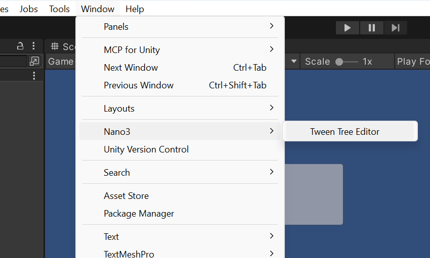
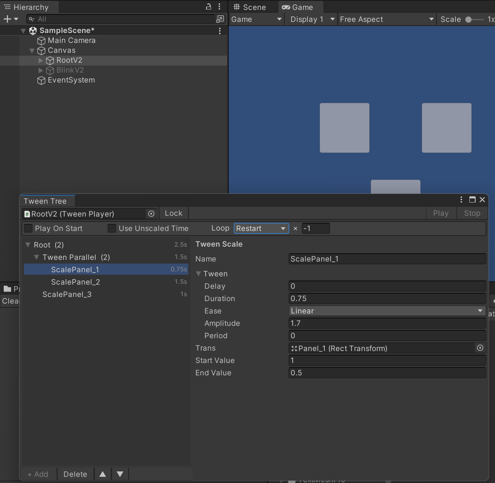

# Tween Animator

A DOTween-based animation tool for Unity, designed mainly for UI. Build complex,
nested animations from a single component and a visual tree editor — no more piling
up one MonoBehaviour per animation.

> Requires [DOTween](http://dotween.demigiant.com/) in the project.
> Tested on Unity 2022.3 (LTS).


<!-- SCREENSHOT: the Tween Tree window next to a GameObject with a TweenPlayer -->

## Features

- **One component, whole animation.** A single `TweenPlayer` holds the entire
  animation tree (leaves + groups) via `[SerializeReference]`.
- **Sequence & Parallel groups** in any nesting combination.
- **Built-in leaf animations:** Scale, Move To Position, Move To Target, Canvas
  Group Alpha, Size, Set Bool, Trigger.
- **Tween Tree editor window:** outliner with add/remove, **drag-and-drop reorder
  and reparent**, **rename**, **duplicate** (whole branch), and a live **duration**
  readout per node.
- **Looping** (Restart, N times or infinite) — e.g. a blinking button.
- **Unscaled time** — keep playing while `Time.timeScale = 0` (gameplay pause).
- **Extensible:** add a new animation by subclassing `TweenAnimation`; it appears
  in the editor's type picker automatically.

## Install via UPM (Package Manager)

1. Open **Window → Package Manager**.
2. Click **+ → Add package from git URL…**
3. Enter:

   ```
   https://github.com/LuchunPen/TweenAnimator.git?path=Packages/src
   ```

DOTween must be present in the project separately (Asset Store or DOTween's own
package), as it is a required dependency and is not bundled.

## Usage — from the Editor

1. Add a **Tween Player** component to a GameObject.
2. Click **Open Tween Tree Editor** (or **Window → Nano3 → Tween Tree Editor**).
3. Set the **Root** node (usually a `Sequence` or `Parallel`), then add child
   nodes and leaf animations. Assign the scene targets (Transform / RectTransform /
   CanvasGroup) in the parameters panel on the right.
4. Options: **Play On Start**, **Use Unscaled Time**, **Loop**.


<!-- SCREENSHOT: a tree with a Sequence -> Parallel -> leaves, params panel open -->

Editor shortcuts:

- **Double-click** a node — rename it.
- **Right-click** a node — Add Child / Change Type / Duplicate / Delete.
- **Drag** a node — reorder within a group, move between groups, or drop onto a
  group (middle of the row) to nest it as a child.
- The right column shows each node's **duration** for one pass (leaf = Delay +
  Duration, Sequence = sum, Parallel = longest child, root = total).

## Usage — from code

Drive an existing tree through the `TweenPlayer` component. Its API:

- `Play(Action onComplete = null)` — play from the current state.
- `Stop()` — kill the animation.
- `ResetAnimation()` — return to the start state.
- `Pause()` / `Resume()` (and `IsPaused`) — pause keeping progress.
- `SetFinishState(Action onComplete = null)` — jump to the finished state.

The sample scene uses this controller (see `Assets/Nano3/Example`), binding the
player to the keyboard — **Q** play, **E** stop, **Space** pause/resume:

```csharp
using UnityEngine;
using Nano3.TweenAnimator;

public class TweenPlayerExample : MonoBehaviour
{
    [SerializeField] private TweenPlayer _player;

    private void Update()
    {
        if (_player == null) { return; }

        if (Input.GetKeyDown(KeyCode.Q))
        {
            _player.ResetAnimation();
            _player.Play(OnComplete);
        }

        if (Input.GetKeyDown(KeyCode.E))
        {
            _player.Stop();
        }

        if (Input.GetKeyDown(KeyCode.Space))
        {
            if (_player.IsPaused) { _player.Resume(); }
            else { _player.Pause(); }
        }
    }

    private void OnComplete()
    {
        Debug.Log("Tween complete");
    }
}
```

## Add a custom animation

Subclass `TweenAnimation` and implement `Apply()`. The `_value` field is the eased
progress in `[0..1]`, driven by the tween each frame. New types show up in the
editor's type picker automatically.

```csharp
using System;
using UnityEngine;
using Nano3.TweenAnimator;

[Serializable]
public class TweenScale : TweenAnimation
{
    [SerializeField] private Transform _trans;
    [SerializeField] private float _startValue = 0f;
    [SerializeField] private float _endValue = 1f;

    protected override void Apply()
    {
        float scale = _startValue + (_value * (_endValue - _startValue));
        _trans.localScale = new Vector3(scale, scale, scale);
    }
}
```

Optional hooks: `OnStarted()`, `OnCompleted()`, `OnReset()`, and `Init()` (for
caching initial state, e.g. the current size). Give a type a friendlier menu entry
with `[TweenNodeMenu("Category/Nice Name")]`.

## License

MIT
